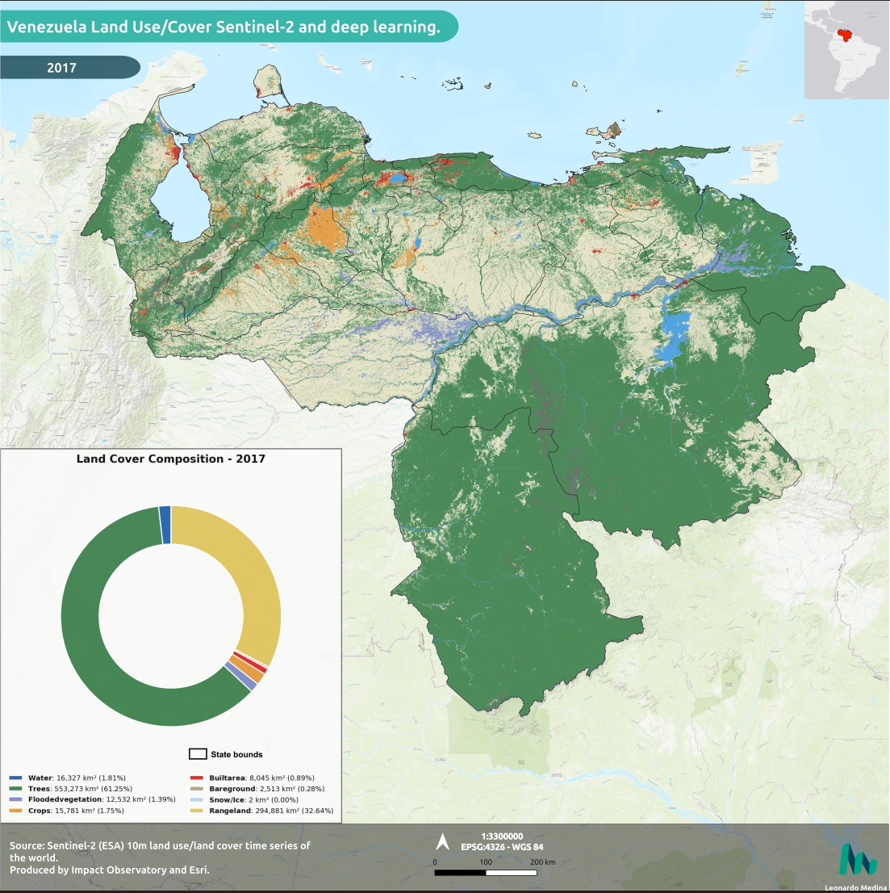
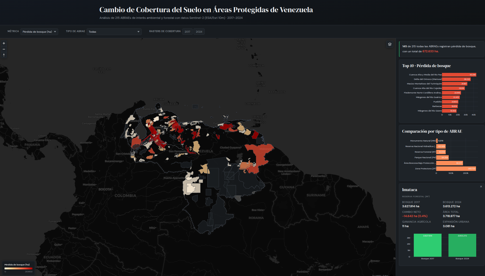

# Venezuela Land Cover Change in Protected Areas (2017–2024)

Land use/land cover change analysis for Venezuela using Sentinel-2 10m LULC data from ESRI Living Atlas. Covers the full national extent (~912,000 km²) at 10-meter resolution, with a focused assessment of change within 215 protected areas (ABRAEs). Results published through an interactive web dashboard.

## What this does

**National analysis:**
- Reprojects 16 satellite tiles (8 per year) from native UTM zones to Albers Equal-Area Conic
- Mosaics and clips to the Venezuelan national boundary
- Computes area statistics per land cover class for 2017 and 2024
- Generates a transition matrix showing class-to-class change in km²
- Produces a spatially explicit change raster



**Protected area analysis:**
- Extracts and filters ABRAE polygons from the World Database on Protected Areas (WDPA)
- Validates geometries, reprojects to Albers Equal-Area, and exports to GeoPackage by ABRAE type
- Computes categorical zonal histograms: pixel counts per land cover class within each ABRAE, for both years
- Derives change indicators per ABRAE: forest loss (ha and %), agricultural gain, urban expansion
- Generates rankings, summaries by ABRAE type, and comparison tables
- Simplifies and reprojects vectors to WGS84 for web display; converts rasters to PMTiles archives via gdal2tiles, mb-util, and pmtiles CLI
- Serves results through an interactive MapLibre GL JS dashboard with map, charts, and raster overlays

## Live dashboard

Static site hosted on GitHub Pages. Map with 215 ABRAE polygons colored by selected metric, filterable by ABRAE type. Raster layers (2017/2024 land cover) served as PMTiles archives with range requests. Basemap switching between dark and satellite. Charts update on filter change.

Stack: MapLibre GL JS, PMTiles, Plotly.js, vanilla HTML/CSS/JS. No framework, no build step, no backend.



## Data

**Land cover:** Sentinel-2 10m Land Use/Land Cover Time Series, produced by Impact Observatory, Microsoft and Esri. Deep learning classification over ESA Sentinel-2 imagery, 9 LULC classes, assessed accuracy >75%.


Source: [ArcGIS Living Atlas](https://www.arcgis.com/home/item.html?id=cfcb7609de5f478eb7666240902d4d3d)

Reference: Karra, Kontgis et al. "Global land use/land cover with Sentinel-2 and deep learning." IGARSS 2021. IEEE.

**Protected areas:** WDPA polygons filtered for Venezuela. Six ABRAE types: National Park, Forest Reserve, Protective Zone, Natural Monument, Wildlife Refuge, Biosphere Reserve.

Source: [Protected Planet](https://www.protectedplanet.net/)

**Elevation:** NASADEM HGT v001 (~30m resolution), downloaded via NASA Earthdata. Used as a base layer for cartographic context.

## Project structure

```
venezuela_landcover/
├── data/
│   ├── raw/                        # Original tiles, boundary, DEM, WDPA shapefiles
│   └── processed/
│       ├── cover/                  # Reprojected, mosaiced, clipped LULC rasters
│       ├── dem/                    # Clipped DEM
│       └── abrae_change_indicators.gpkg
├── outputs/
│   ├── figures/                    # Chart exports (PNG)
│   ├── results/                    # National-level CSV tables
│   └── zonal/                      # Per-ABRAE zonal histograms and comparisons
├── scripts/
│   ├── project_clip_raster.py      # GDAL pipeline: reproject, mosaic, clip
│   ├── analyze_cover.py            # National stats, transition matrix, change raster
│   ├── download_dem.py             # NASADEM download via Earthdata
│   ├── prepare_web_data.py         # Optimize vectors/tables for web
│   └── generate_pmtiles.sh         # gdal2tiles + mb-util + pmtiles packaging
├── notebooks/
│   ├── cover_analysis.ipynb        # National-level visualization
│   ├── abraes_extract.ipynb        # WDPA filtering and ABRAE preparation
│   └── abraes_analysis.ipynb       # Zonal statistics, change indicators, ABRAE maps
├── docs/                            # Web dashboard (GitHub Pages)
│   ├── index.html
│   ├── css/styles.css
│   ├── js/app.js
│   └── data/
│       ├── abrae_web.geojson
│       ├── venezuela_boundary.geojson
│       ├── *.csv
│       └── rasters/
│           ├── lc2017.pmtiles      # Land cover 2017 raster tiles
│           └── lc2024.pmtiles      # Land cover 2024 raster tiles
└── qgis/                           # QGIS project files for cartographic output
```

## Setup

With conda (recommended):

```bash
conda env create -f environment.yml
conda activate cover_venezuela
```

With pip:

```bash
python -m venv venv
source venv/bin/activate
pip install -r requirements.txt
```

Note: pip users need GDAL installed separately (`sudo apt install gdal-bin libgdal-dev` on Ubuntu).

DEM download requires a [NASA Earthdata](https://urs.earthdata.nasa.gov/) account.

## Usage

### Phase 1: National land cover analysis

```bash
# Reproject tiles, build mosaic, clip to boundary
python scripts/project_clip_raster.py

# Compute national stats and generate change raster
python scripts/analyze_cover.py

# Download and process DEM (requires Earthdata login)
python scripts/download_dem.py
```

National-level visualization in `notebooks/cover_analysis.ipynb`.

### Phase 2: Protected area (ABRAE) analysis

```bash
# Run notebooks in order:
# 1. Extract and filter ABRAE polygons from WDPA
#    notebooks/abraes_extract.ipynb
#
# 2. Zonal statistics, change indicators, exploratory maps
#    notebooks/abraes_analysis.ipynb

# Prepare web-optimized vectors and tables
python scripts/prepare_web_data.py

# Generate PMTiles raster archives (requires pmtiles CLI and mbutil)
# Install pmtiles: https://github.com/protomaps/go-pmtiles/releases
# Install mbutil: pip install mbutil
chmod +x scripts/generate_pmtiles.sh
./scripts/generate_pmtiles.sh

# Serve locally
python -m http.server 8000 --directory src
```

Cartographic output produced in QGIS Print Layout from  Sentinel-2 10m LULC data from ESRI Living Atlas
[Download full cartographic PDF with LULC](https://github.com/leomed512/venezuela_LUC_2017_2024/blob/master/qgis/LUC_ven_pdf_2.pdf)

## Projection

Albers Equal-Area Conic, custom parameters for Venezuela:
- Standard parallels: 2°N and 10°N
- Central meridian: 66°W
- Datum: WGS84

Preserves area measurements across the full national extent. Analysis in Albers; web output reprojected to WGS84 (EPSG:4326).

## Tools

GDAL, Python (rasterio, rasterstats, numpy, pandas, geopandas, earthaccess), MapLibre GL JS, PMTiles, Plotly.js, QGIS, matplotlib, seaborn.

## Author

Leonardo Medina | Forestry Engineer - GIS Analyst  — [LinkedIn](https://www.linkedin.com/in/leomedinast/)